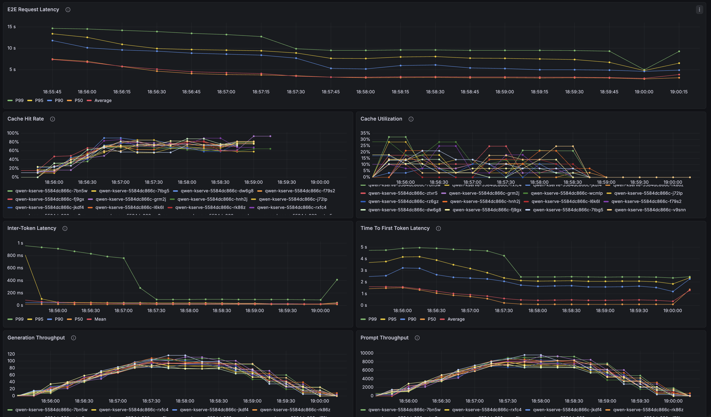
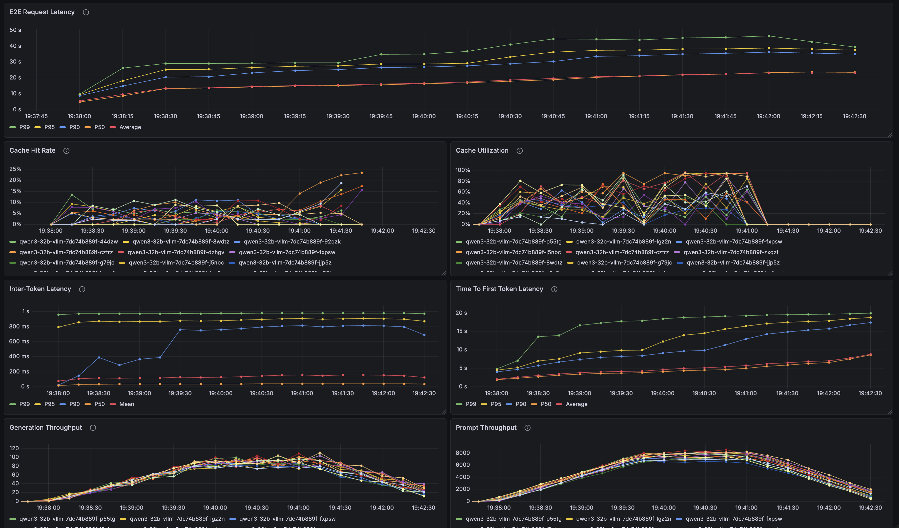

# CKS GTC Demo

## Installation

### Setup your service account token

- Add pull-secret

```bash
mkdir -p ~/.config/containers
cp ~/token.json ~/.config/containers/auth.json
```

### Install

> Make sure your $KUBECONFIG is set to an absolute path!

```bash
# deploy pre-requisites
make deploy-all
```

```bash
# confirm install working
make status

=== Deployment Status ===
cert-manager-operator:
NAME                                                       READY   STATUS    RESTARTS   AGE
cert-manager-operator-controller-manager-5f95bc4bd-qtshq   1/1     Running   0          8m29s

cert-manager:
NAME                                       READY   STATUS    RESTARTS   AGE
cert-manager-699cdbb7db-zfkjz              1/1     Running   0          8m27s
cert-manager-cainjector-7f876dc699-8n44x   1/1     Running   0          8m27s
cert-manager-webhook-6487d5b898-7cwzr      1/1     Running   0          8m27s

istio:
NAME                                    READY   STATUS    RESTARTS   AGE
servicemesh-operator3-9cf6695cd-8qdzc   1/1     Running   0          8m16s

lws-operator:
NAME                                      READY   STATUS    RESTARTS   AGE
lws-controller-manager-58c5dd85bf-kd469   1/1     Running   0          6m21s
lws-controller-manager-58c5dd85bf-zqdfj   1/1     Running   0          6m21s
openshift-lws-operator-89f74cd5b-k2nlf    1/1     Running   0          7m54s

kserve:
NAME                                        READY   STATUS    RESTARTS   AGE
kserve-controller-manager-5c69c4cfc-jjms2   1/1     Running   0          6m44s

kserve config:
NAME                                             AGE
kserve-config-llm-decode-template                6m44s
kserve-config-llm-decode-worker-data-parallel    6m44s
kserve-config-llm-prefill-template               6m44s
kserve-config-llm-prefill-worker-data-parallel   6m44s
kserve-config-llm-router-route                   6m44s
kserve-config-llm-scheduler                      6m44s
kserve-config-llm-template                       6m44s
kserve-config-llm-template-amd-rocm              6m44s
kserve-config-llm-worker-data-parallel           6m44s

=== Readiness Checks ===
-n cert-manager webhook: 
Ready

=== API Versions ===
-n InferencePool API: 
v1 (inference.networking.k8s.io)
-n Istio version: 
v1.27-latest
```

```bash
# deploy the gateway
./scripts/setup-gateway.sh
```


```bash
robertgshaw@Roberts-MacBook-Pro validation % kubectl get gateways -A
NAMESPACE     NAME                CLASS   ADDRESS     PROGRAMMED   AGE
opendatahub   inference-gateway   istio   10.16.4.1   True         18m
```

## Hello, World Deployment

### Setup

- create namespace
```bash
export NAMESPACE=llm-d-rhaii
kubectl create namespace $NAMESPACE
```

- copy access token + configure serviceaccount
```bash
kubectl get secret redhat-pull-secret -n istio-system -o json | \
  jq 'del(.metadata.resourceVersion, .metadata.uid, .metadata.creationTimestamp, .metadata.annotations, .metadata.labels) | .metadata.namespace = "'$NAMESPACE'"' | \
  kubectl create -f -

kubectl patch serviceaccount default -n $NAMESPACE \
  -p '{"imagePullSecrets": [{"name": "redhat-pull-secret"}]}'
```

### Download Model and Deploy

- download model to cluster
```bash
kubectl apply -f hello-world/gpt-oss-pvc.yaml
kubectl apply -f hello-world/download-job.yaml
```

- deploy
```bash
kubectl apply -f hello-world/deploy.yaml
```

### Make Inference Request

- port forward (in separate terminal)
```bash
kubectl port-forward svc/inference-gateway-istio 8080:80 -n opendatahub
```

- curl the endpoint
```bash
curl http://localhost:8080/llm-d-rhaii/gpt-oss/v1/chat/completions \
  -H "Content-Type: application/json" \
  -d '{
    "model": "openai/gpt-oss-120b",
    "messages": [
      {"role": "user", "content": "Hello!"}
    ],
    "max_tokens": 50
  }'
```


## Intelligent Inference Scheduling

### Setup

- create namespace
```bash
export NAMESPACE=llm-d-rhaii
kubectl create namespace $NAMESPACE
```

- copy access token + configure serviceaccount
```bash
kubectl get secret redhat-pull-secret -n istio-system -o json | \
  jq 'del(.metadata.resourceVersion, .metadata.uid, .metadata.creationTimestamp, .metadata.annotations, .metadata.labels) | .metadata.namespace = "'$NAMESPACE'"' | \
  kubectl create -f -

kubectl patch serviceaccount default -n $NAMESPACE \
  -p '{"imagePullSecrets": [{"name": "redhat-pull-secret"}]}'
```

### Enable Monitoring (Optional)

- Follow the guide to install [monitoring stack](monitoring-stack/cks/README.md)

- enable KServe monitoring. When enabled, KServe automatically creates `PodMonitor` resources for vLLM pods.

```bash
kubectl set env deployment/kserve-controller-manager \
  -n opendatahub \
  LLMISVC_MONITORING_DISABLED=false
```


### Download Model and Deploy

- download model to cluster
```bash
kubectl apply -f intelligent-inference-scheduling/qwen-pvc.yaml
kubectl apply -f intelligent-inference-scheduling/download-job.yaml
```

- deploy
```bash
kubectl apply -f intelligent-inference-scheduling/deploy.yaml
```

### Make Inference Request

- port forward (in separate terminal)
```bash
kubectl port-forward svc/inference-gateway-istio 8080:80 -n opendatahub
```

- curl the endpoint
```bash
curl http://localhost:8080/llm-d-rhaii/qwen/v1/chat/completions \
  -H "Content-Type: application/json" \
  -d '{
    "model": "Qwen/Qwen3-32B",
    "messages": [
      {"role": "user", "content": "Hello!"}
    ],
    "max_tokens": 50
  }'
```

### Run llm-d Benchmark

- benchmark baseline (go to `intelligent-inference-scheduling/benchmarking` directory)

```bash
OUTPUT_DIR=llm-d-output ./run-bench.sh
```

- logs
```bash
(APIServer pid=7) INFO 02-25 20:49:56 [loggers.py:127] Engine 000: Avg prompt throughput: 6735.6 tokens/s, Avg generation throughput: 75.0 tokens/s, Running: 4 reqs, Waiting: 0 reqs, GPU KV cache usage: 13.9%, Prefix cache hit rate: 54.2%
```

- results
```bash
"request_latency": {
  "mean": 3.9748916367432794,
  "min": 2.0749029461294413,
  "max": 12.032803084002808,
  "p0.1": 2.081096272104187,
  "p1": 2.139109589313157,
  "p5": 2.229016542690806,
  "p10": 2.2952557446435096,
  "p25": 2.4869498594780453,
  "median": 3.3404055075952783,
  "p75": 4.674160644470248,
  "p90": 6.633666849927976,
  "p95": 8.02951636759098,
  "p99": 10.069368822372052,
  "p99.9": 11.620172555086494
},
```




### Run Baseline Benchmark

- deploy
```bash
kubectl apply -f intelligent-inference-scheduling/baseline.yaml
```

- benchmark baseline (go to `intelligent-inference-scheduling/benchmarking` directory)
```bash
export SVC_IP="$(kubectl -n "${NAMESPACE}" get svc qwen3-32b-vllm -o jsonpath='{.spec.clusterIP}' 2>/dev/null || true)"
export SVC_PORT="$(kubectl -n "${NAMESPACE}" get svc qwen3-32b-vllm -o jsonpath='{.spec.ports[?(@.name=="http")].port}' 2>/dev/null || true)"

RAW_IP=$SVC_IP RAW_PORT=$SVC_PORT OUTPUT_DIR=baseline-output ./run-bench.sh
```

- logs:
```bash
(APIServer pid=1) INFO 02-25 20:25:01 [loggers.py:127] Engine 000: Avg prompt throughput: 8434.1 tokens/s, Avg generation throughput: 19.9 tokens/s, Running: 12 reqs, Waiting: 11 reqs, GPU KV cache usage: 40.7%, Prefix cache hit rate: 4.7%
```

- results:
```bash
"request_latency": {
  "mean": 20.99757727551619,
  "min": 2.95767285884358,
  "max": 43.27342223213054,
  "p0.1": 3.192630859974539,
  "p1": 5.152513729878701,
  "p5": 7.8027134836534975,
  "p10": 10.169069463293999,
  "p25": 13.928895238146652,
  "median": 19.50498054549098,
  "p75": 28.726124470005743,
  "p90": 33.177602148195724,
  "p95": 36.318112793040925,
  "p99": 39.55015729173551,
  "p99.9": 42.78112650714849
},
```

